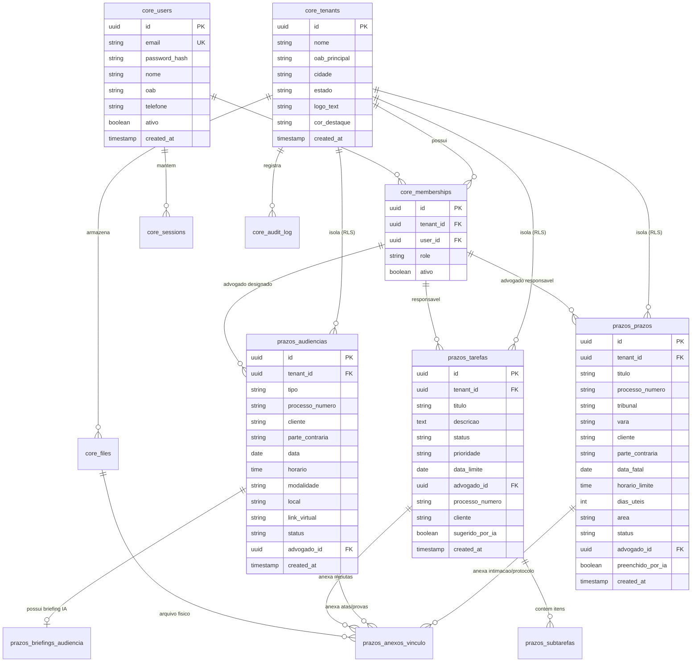

# ANALISE.md: Análise da Aplicação e Arquitetura de Plataforma (Portão 1)

> **Documento Gerado:** Fase 1 — Análise Estrita do Frontend e Fundação de Plataforma  
> **Produto:** Gregório Jurídico — Sistema SaaS de Gestão Forense, Prazos, Audiências e Tarefas  
> **Slug do Módulo:** `prazos`  
> **Modo de Plataforma:** Modo B (Greenfield: criação de `platform-core` e módulo `modules/prazos`)  
> **Provedor de LLM:** Google Gemini via `platform-ai`  
> **Banco e Storage:** PostgreSQL 16+ com RLS forçada + Supabase Storage (S3-compatível com URLs assinadas curtas)  

---

## 1. Parâmetros e Premissas Confirmadas

```ini
NOME DO PRODUTO:            Gregório Jurídico
SLUG DO MÓDULO:             prazos   → schema `prazos.*`, rotas /api/v1/prazos/...
DESCRIÇÃO EM 1 FRASE:       Plataforma SaaS multi-tenant para controle de prazos processuais (CPC/CPP/CLT), pauta de audiências e quadro de tarefas para bancas de advocacia, com copiloto de IA forense e gestão segura de arquivos.
SETOR / DOMÍNIO:            Jurídico (Contencioso Cível, Trabalhista, Tributário, Família, etc.)
DADOS SENSÍVEIS:            Processos judiciais (CNJ, segredo de justiça), nomes de clientes e partes contrárias, documentos processuais e intimações anexadas (PDF/DOCX), credenciais de advogados, OAB, estratégias jurídicas.
CONFORMIDADE:               LGPD (Lei 13.709/2018), Sigilo Profissional da Advocacia (Lei 8.906/94 e Código de Ética da OAB). Confidencialidade por padrão.
USA IA (4.B):               SIM. Ativado (Google Gemini).
MÓDULO ARQUIVOS (4.C):      SIM. Ativado (Supabase Storage S3-compatível).
MÓDULO PRAZOS (4.D):        SIM. Ativado (Cálculo determinístico CPC/CLT, dias úteis, fuso horário).
MÓDULO INTEGRAÇÕES (4.E):   FUTURO / BACKLOG (Tribunais PJe/e-SAJ diretos via crawler/API).
MODO DE PLATAFORMA:         Modo B (Greenfield: repo cria monorepo com platform-core + modules/prazos).
MODELO MULTI-TENANT:        SaaS multi-tenant white-label (Banco compartilhado com schema/RLS forçada por tenant_id).
PERFIS MAPEADOS:            Superadmin da Plataforma, Sócio/Admin do Escritório, Advogado Associado, Estagiário/Assistente.
```

---

## 2. Varredura da Aplicação Atual (`c:\gregorio`)

### 2.1 Stack Frontend Identificada
* **Core:** React 18.2 + Vite 5 + TypeScript 5.2 strict (`package.json`, linhas 11-26).
* **Estilos:** Tailwind CSS 3.4 (`tailwind.config.js`), suporte nativo a Dark Mode via classe `.dark` no elemento raiz (`ThemeContext.tsx`, linhas 1-65).
* **Roteamento & Telas:** Estado de abas em memória via `ViewTab` (`'dashboard' | 'prazos' | 'audiencias' | 'tarefas' | 'pauta_impressao'`) gerenciado no `App.tsx` (linhas 1-216).
* **Validação de Formulários:** Validação manual básica de campos nos modais (`PrazoFormModal.tsx`, `AudienciaFormModal.tsx`, `TarefaFormModal.tsx`).
* **Chamadas HTTP:** **0 chamadas HTTP remotas**. Toda a persistência atual ocorre no navegador via `localStorage` e React Contexts (`TenantContext.tsx`, `AuthContext.tsx`).

### 2.2 Inventário de Mocks e Fontes de Dados a Substituir por Backend Real

| Item Mockado | Localização no Código Atual | Impacto / Risco | Substituição no Backend (Plataforma) |
|---|---|---|---|
| **Escritórios (Tenants)** | `src/data/initialData.ts` (linhas 13-100) e `TenantContext.tsx` | Dados fixos salvos no `localStorage_tenants` | Tabela `core.tenants` com RLS, configurações de branding, logo e fuso horário |
| **Advogados e Usuários** | `src/data/initialData.ts` (linhas 27-51, 63-87) | Senhas em texto claro simuladas (`••••••••`) no `LoginView.tsx` | Tabela `core.users` e `core.memberships` com hash Argon2id, sessões seguras e TOTP |
| **Autenticação em 2 Etapas** | `src/components/auth/LoginView.tsx` (linhas 1-269) | Acesso fake sem validação criptográfica de credenciais | Endpoints de login server-side com cookies `HttpOnly`, `SameSite=Lax`, rotação de sessão |
| **Prazos Processuais** | `src/data/initialData.ts` (linhas 102-180) | Prazos salvos no `localStorage_prazos` | Tabela `prazos.prazos` com RLS forçada (`tenant_id`), histórico e auditoria imutável |
| **Audiências** | `src/data/initialData.ts` (linhas 182-260) | Audiências salvas no `localStorage_audiencias` | Tabela `prazos.audiencias` com controle de status, salas virtuais e pauta |
| **Tarefas e Subtarefas** | `src/data/initialData.ts` (linhas 262-375) | Kanban e checklists em `localStorage_tarefas` | Tabela `prazos.tarefas` e `prazos.subtarefas` com delegação de responsáveis |
| **Anexos e Arquivos (4.C)** | `src/utils/fileStorage.ts` (linhas 1-47) | Arquivos salvos em memória (`blobRegistry = new Map()`) | Supabase Storage (S3) com bucket privado, validação por magic bytes e URLs assinadas |
| **Simulador de IA (4.B)** | `src/utils/aiSimulator.ts` (linhas 1-233) | Regex e heurísticas estáticas simulando extração de intimação e briefings | `platform-ai` conectado à API do Google Gemini com structured output via Zod |
| **Cálculo de Urgência (4.D)** | `src/utils/dateUtils.ts` (linhas 30-73) | Cálculo simplificado em dias corridos sem feriados forenses | Motor determinístico de prazos (`DeadlineEngine`) com suporte a dias úteis do CPC |

---

## 3. Modelo de Entidades e Convergência de Plataforma

### 3.1 Onde cada Entidade Mora (`core` vs `prazos`)

Conforme a arquitetura de plataforma do **JurisFlow v2 / DocuMind IA**:
* **`core.*` (Platform-Core):**
  * `core.tenants`: Escritórios de advocacia clientes (razão social, CNPJ/OAB, cores whitelabel, fuso horário, limites).
  * `core.users`: Usuários da plataforma (nome, e-mail único, senha com Argon2id, telefone, status).
  * `core.memberships`: Vínculo usuário ↔ tenant com papel RBAC (`superadmin`, `admin_socio`, `advogado`, `estagiario`).
  * `core.sessions`: Sessões server-side ativas com revogação e auditoria de IP/User-Agent.
  * `core.audit_log`: Trilha de auditoria append-only para conformidade com LGPD e compliance forense.
  * `core.files`: Metadados de arquivos armazenados no Supabase Storage (hash SHA-256, tamanho, mime, tenant_id).
* **`prazos.*` (Módulo de Prazos, Audiências e Tarefas):**
  * `prazos.prazos`: Prazos judiciais/administrativos com datas fatais, tribunal, vara, número CNJ e partes.
  * `prazos.audiencias`: Audiências presenciais e virtuais, modalidade, links de videoconferência e notas.
  * `prazos.tarefas`: Atividades operacionais vinculadas aos processos e audiências com status de workflow.
  * `prazos.subtarefas`: Itens de checklist procedurais (sugeridos por IA ou manuais).
  * `prazos.briefings_audiencia`: Síntese estruturada de 3 tópicos gerada pela IA forense.
  * `prazos.anexos_vinculo`: Vínculo N:N entre os recursos do módulo e os arquivos em `core.files`.

### 3.2 Diagrama Entidade-Relacionamento (ERD)



---

## 4. Classificação de Dados e Conformidade (LGPD)

| Campo / Entidade | Categoria de Dado | Sensibilidade | Base Legal (LGPD) | Medida de Segurança Obrigatória |
|---|---|---|---|---|
| Nome do Advogado, E-mail, Telefone, OAB | Dado Pessoal Cadastral | Média | Execução de Contrato (Art. 7º, V) | Criptografia em trânsito, hash de senha Argon2id, logs com redaction de PII |
| Nome de Partes Contrárias, Testemunhas | Dado Pessoal de Terceiros | Alta | Exercício Regular de Direitos em Processo Judicial (Art. 7º, VI) | RLS estrita por tenant, proibição de vazamento em logs/métricas |
| Número CNJ, Vara, Tribunal | Dado Processual Público / Restrito | Média/Alta | Exercício Regular de Direitos (Art. 7º, VI) | Validação por regex CNJ, proteção contra enumeração (anti-BOLA) |
| Segredo de Justiça / Notas Estratégicas | Dado Confidencial Forense | Crítica | Sigilo Profissional da Advocacia (Lei 8.906/94) | Acesso exclusivo ao tenant e aos advogados autorizados; omissão em relatórios não autorizados |
| Arquivos de Peças / Intimações (PDF/DOCX) | Documento Processual Confidencial | Crítica | Exercício Regular de Direitos (Art. 7º, VI) | Bucket privado no Supabase, URLs assinadas com TTL curto (15 min), scan ClamAV |
| Contexto enviado à IA (Gemini) | Texto de Publicação / Inicial | Crítica | Apoio Operacional ao Exercício de Direitos | Envio mínimo necessário, sem retenção para treino de modelos, filtro por tenant_id |

---

## 5. Módulos Condicionais Ativados

* **[x] 4.B Inteligência Artificial (Google Gemini):**
  * *Evidência no código:* `src/utils/aiSimulator.ts` (linhas 30-154: extração de intimação; linhas 163-189: briefing de audiência; linhas 194-232: checklist de tarefas).
  * *Implementação:* Pacote `platform-ai` com client oficial do Google Gemini, chaves no servidor (`GEMINI_API_KEY`), isolamento estrito por `tenant_id`, schemas Zod para structured output e sanitização contra prompt injection.
* **[x] 4.C Arquivos e Uploads (Supabase Storage):**
  * *Evidência no código:* `src/utils/fileStorage.ts` (linhas 1-47: upload e download de arquivos PDF/DOCX) e `FileUpload.tsx` (linhas 1-198).
  * *Implementação:* Pacote `platform-storage` integrando Supabase Storage, validação de magic bytes, limites de tamanho (15 MB), URLs pré-assinadas para download e upload direto seguro.
* **[x] 4.D Prazos, Agendas e Urgências:**
  * *Evidência no código:* `src/utils/dateUtils.ts` (linhas 30-73: faixas de urgência 'vence hoje', 'urgente < 3d', etc.) e `cnjUtils.ts` (linhas 1-46: tribunal do CNJ).
  * *Implementação:* Motor determinístico de cálculo de prazos com fuso horário por tenant e tabela de testes de feriados/dias úteis.
* **[ ] 4.E Integrações Externas (Tribunais):**
  * Não há chamadas diretas a tribunais no código atual (o frontend apenas gera o link externo `linkTribunal` em `PrazoFormModal.tsx`). Módulo mantido como sugestão pós-lançamento 🟢.

---

## 6. Modelo de Ameaças (STRIDE) e Matriz de Segurança

### 6.1 Matriz de Ameaças por Fluxo

| Fluxo / Superfície | Ameaça (STRIDE) | Risco | Mitigação Arquitetural |
|---|---|---|---|
| **Acesso a Prazos / Audiências** | Information Disclosure / Spoofing (BOLA/IDOR) | **Crítico** | `SET LOCAL app.tenant_id = :tenant_id` em toda transação + `FORCE ROW LEVEL SECURITY` no PostgreSQL. Usuário só consulta seu tenant. |
| **Download de Arquivos Processuais** | Elevation of Privilege / Tampering | **Alto** | URLs assinadas pelo servidor com TTL de 15 minutos; checagem de permissão e tenant antes de emitir a URL de download. |
| **Upload de Peças / Intimações** | Tampering / Denial of Service (Malware/Zip Bomb) | **Alto** | Validação por magic bytes (não confiar no Content-Type do cliente), restrição estrita a PDF/DOCX, limite de 15MB, antivírus. |
| **Leitura de Intimações com Gemini** | Prompt Injection (Direta e Indireta) | **Alto** | O texto da publicação é tratado como não confiável. O prompt instrui o modelo a extrair apenas dados estruturados em JSON validado via Zod (`strict`). |
| **Baixa Formal de Prazo Fatal** | Repudiation / Elevation of Privilege | **Alto** | Estagiário não pode alterar status para `cumprido` sem aprovação de Advogado/Sócio. Trilha de auditoria imutável (`core.audit_log`). |
| **Vazamento de PII em Logs** | Information Disclosure | **Médio** | Redaction automática com Pino em headers, tokens, nomes, CPFs e dados de processos. |

### 6.2 Matriz de Permissões RBAC (Recurso × Ação × Perfil)

| Recurso | Ação | Superadmin | Sócio / Admin | Advogado Associado | Estagiário / Assistente |
|---|---|:---:|:---:|:---:|:---:|
| `prazos.prazos` | Listar / Visualizar | ❌ (Suporte auditado) | ✅ | ✅ | ✅ |
| `prazos.prazos` | Criar Prazo | ❌ | ✅ | ✅ | ✅ (com aviso de revisão) |
| `prazos.prazos` | Editar / Baixar Cumprido | ❌ | ✅ | ✅ | ❌ (Bloqueado) |
| `prazos.prazos` | Excluir Prazo | ❌ | ✅ | ❌ | ❌ |
| `prazos.audiencias` | Visualizar / Briefing IA | ❌ | ✅ | ✅ | ✅ |
| `prazos.audiencias` | Criar / Redesignar | ❌ | ✅ | ✅ | ❌ |
| `prazos.audiencias` | Excluir Audiência | ❌ | ✅ | ❌ | ❌ |
| `prazos.tarefas` | Criar / Mover Status | ❌ | ✅ | ✅ | ✅ |
| `prazos.tarefas` | Excluir Tarefa | ❌ | ✅ | ✅ | ❌ |
| `core.files` | Upload Anexo | ❌ | ✅ | ✅ | ✅ |
| `core.files` | Download Anexo | ❌ | ✅ | ✅ | ✅ |
| `core.tenants` | Configurar Escritório | ❌ | ✅ | ❌ | ❌ |
| `core.users` | Gerenciar Equipe | ❌ | ✅ | ❌ | ❌ |

---

## 7. Inventário de Endpoints Alvo (`/api/v1/prazos/...` e `core`)

```
AUTENTICAÇÃO & CONTA (core):
POST   /api/v1/auth/login                  # Autenticação com e-mail/senha, retorna sessão segura
POST   /api/v1/auth/logout                 # Encerra sessão server-side
GET    /api/v1/auth/me                     # Perfil do usuário autenticado e seus escritórios (tenants)
POST   /api/v1/auth/recuperar-senha        # Solicita token de recuperação de senha
POST   /api/v1/auth/redefinir-senha        # Redefine senha com token seguro de uso único
PATCH  /api/v1/auth/perfil                 # Atualiza perfil do advogado autenticado

ESCRITÓRIOS & TENANTS (core):
GET    /api/v1/tenants/atual               # Dados do escritório ativo (nome, logo, cores whitelabel)
PATCH  /api/v1/tenants/atual               # Atualização de configurações do escritório (apenas Sócio)
GET    /api/v1/tenants/atual/equipe        # Lista advogados e colaboradores da banca

ARQUIVOS & STORAGE (platform-storage / Supabase):
POST   /api/v1/arquivos/upload-url         # Gera URL assinada de upload validada por tenant
GET    /api/v1/arquivos/:id/download-url   # Gera URL assinada curta de download autorizada

PRAZOS PROCESSUAIS (modules/prazos):
GET    /api/v1/prazos                      # Lista prazos com filtros (urgência, status, área, advogado)
POST   /api/v1/prazos                      # Cadastro de novo prazo processual
GET    /api/v1/prazos/:id                  # Detalhes do prazo com seus anexos
PATCH  /api/v1/prazos/:id                  # Edição de dados do prazo
POST   /api/v1/prazos/:id/cumprir          # Baixa formal de cumprimento com anexo de protocolo
DELETE /api/v1/prazos/:id                  # Exclusão lógica (soft delete com auditoria)

AUDIÊNCIAS (modules/prazos):
GET    /api/v1/prazos/audiencias           # Lista pauta de audiências
POST   /api/v1/prazos/audiencias           # Cadastro de audiência (presencial ou virtual)
GET    /api/v1/prazos/audiencias/:id       # Detalhes e notas estratégicas da audiência
PATCH  /api/v1/prazos/audiencias/:id       # Atualização de status e sala
DELETE /api/v1/prazos/audiencias/:id       # Cancelamento / exclusão

TAREFAS E WORKFLOW (modules/prazos):
GET    /api/v1/prazos/tarefas              # Lista tarefas (visão Kanban e Checklist)
POST   /api/v1/prazos/tarefas              # Criação de tarefa vinculada a processo
PATCH  /api/v1/prazos/tarefas/:id          # Atualização de status (A Fazer -> Concluído)
PATCH  /api/v1/prazos/tarefas/:id/subtarefas/:subId # Toggle de subtarefa
DELETE /api/v1/prazos/tarefas/:id          # Exclusão de tarefa

COPILOTO IA FORENSE (platform-ai / Google Gemini):
POST   /api/v1/prazos/ia/analisar-intimacao # Extração estruturada do recorte ou arquivo de intimação
POST   /api/v1/prazos/ia/briefing-audiencia # Geração de síntese estratégica em 3 tópicos
POST   /api/v1/prazos/ia/sugerir-checklist  # Geração de subtarefas procedurais
```

---

## 8. Parecer de QA e Matriz de Riscos

### 8.1 Riscos e Estratégia de Mitigação
1. **Risco de Vazamento Multi-Tenant:** Toda query executada no banco DEVE rodar dentro de transação com `SET LOCAL app.tenant_id` e políticas RLS `FOR ALL USING (tenant_id = current_setting('app.tenant_id')::uuid)`. Será testada com Postgres real via Testcontainers.
2. **Risco de Alucinação na IA (Datas e Artigos de Lei):** O LLM é instruído e obrigado via Zod Structured Outputs a retornar datas calculadas de acordo com as regras explícitas. A UI já possui o banner visual *"Sugerido por IA — confira antes de salvar"*, garantindo a revisão humana obrigatória.
3. **Compatibilidade do Frontend:** O frontend existente consome estados locais. Criaremos um client TypeScript tipado (`src/services/api.ts`) que substitui transparentemente as chamadas locais sem alterar a experiência visual ou usabilidade do usuário.

---

## 9. Registro de Conclusão da Fase 1

A Fase 1 (Análise) está concluída com todo o mapeamento técnico, entidades, endpoints, modelo de segurança STRIDE e matriz RBAC documentados.

> 🚦 **PORTÃO 1: AGUARDANDO CONFIRMAÇÃO DO USUÁRIO**  
> Confirme o recebimento desta análise para que possamos avançar imediatamente para a **Fase 2 (Elaboração do PLANO.md com os ADRs e Manifesto do Módulo)**.
